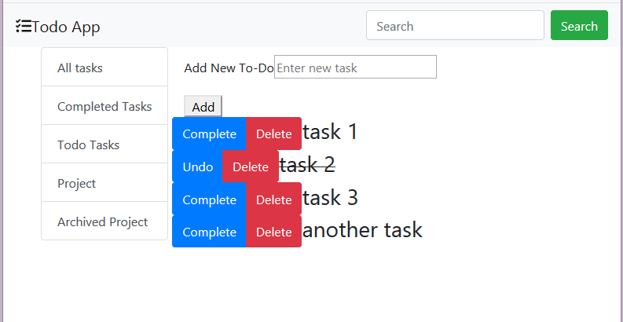

## Description
A todo app use react hook

# Steps to run app

## Run json server
  > cd restApi then node api.js

  or
  > run file runService.bat

## Run ui
  > npm start

## Run test 
  > npm test
